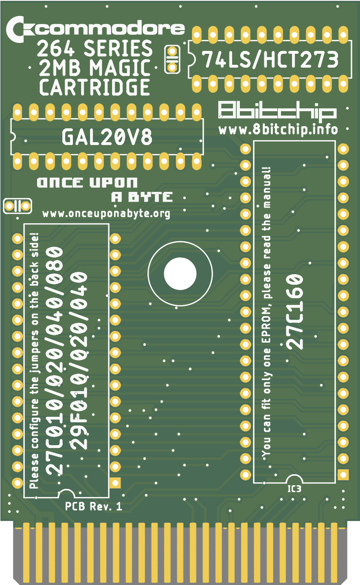
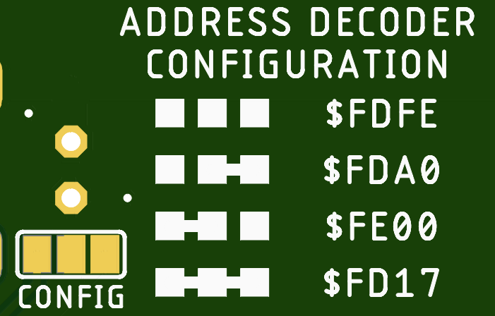
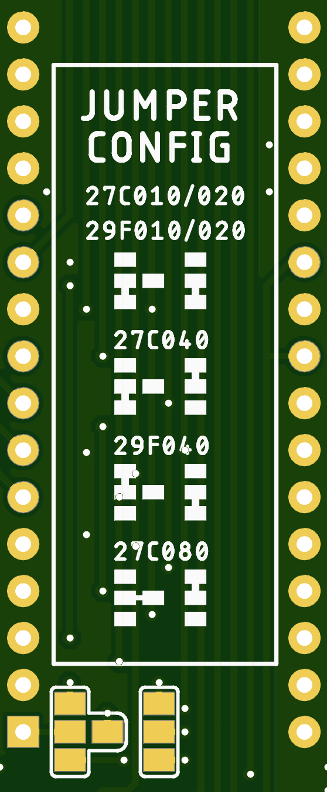
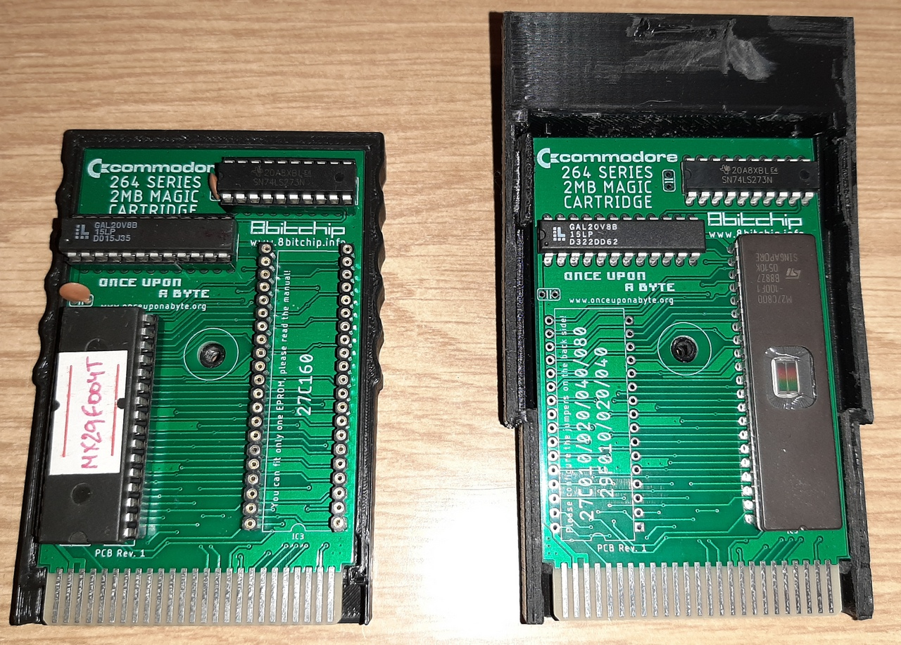

# c264-magic-cart
Hardware design of a cartridge for the Commodore 264 series of computers - Commodore 16, 116 and plus/4

This is the hardware part that accompanies the project of [Magic Cartridge Generator](https://bitbucket.org/zzarko/magic-cartridge-generator/)

This project is free to use and you can use any PCB manufacturer by downloading the Gerber files, but if you would like to support my work and help with further hardware development you can order these PCBs on PCBWay trough this link:

You will get cheap and professionally made PCBs, I will get credits that will help with this and [other projects](https://www.pcbway.com/project/member/?bmbno=1DE407A1-1650-47). Also, if you have to register to that site, [you can use this link](https://www.pcbway.com/setinvite.aspx?inviteid=296307) to get bonus initial credit.

Hardware Description
--------------------

Original Commodore 264 cartridges could be up to 32 Kb in size, in two separate banks of 16Kb. This cartridge implements a latch which is tied to a memory address, so it can address (in this incarnation) up to 2 megabytes of data (128 banks of 16Kb). In that regard, it is very similar to Magic Desk or Ocean cartridges for the Commodore 64.

EPROM is selected by the C1LO selection line coming from the computer, and the 16k of data from the selected bank is visible in the memory map at addresses $8000 - $BFFF.

Inputs of an 8-bit latch (74LS273) are connected to the data lines. A GAL20V8 is responsible for decoding writes to a memory address by decoding the full address bus. Decoder has the option of decoding several frequently used addresses for banking cartridges, since there is no standard address defined. This cartridge is primarily designed to enable making onefile program compilations through the [Magic Cartridge Generator](https://bitbucket.org/zzarko/magic-cartridge-generator/).

The PCB was designed to accommodate various types of EPROMs and their FLASH variants. The smallest EPROM you can use is 27C010 (128Kb), and the largest is 27C160 (2Mb). There are two EPROM sockets, but you cannot use both at the same time. The left socket accepts standard 8-bit EPROMs and their FLASH variants (27C010 to 27C080) and the right socket is for 27C160 (16-bit EPROM in 8-bit mode).

Address decoder
---------------

The address decoder is implemented in GAL20V8. All 16 address lines, /PHI2 and /RW are connected to the GAL to enable single-address decoding. Of course, a GAL16V8 could have been used, but it would only be capable of decoding an address in 16-byte blocks, or the address decoder could be implemented in TTL logic which would require at least 3 ICs. Two spare inputs were used to create a selection jumper to select between four commonly used addresses for cartridge banking. The default address used is $FDFE, which is mentioned in the document at http://solder-synergy.de/plus4/hardware/makers/ioarea.txt as "Register on EPROM-card". Other addresses which can be configured are $FE00 (used on a Hungarian homebrew cartridge found at https://www.commodoreszerviz.hu/commodore_16-116-plus_4_1mb_cartridge_juhasz_jacint.htm), $FDA0 used by another homebrew cartridge, and $FD17 which is also mentioned in the document above as "Register for EPROM-/sRAM-expansion". 

The address decoder is configured with a solder-jumper on the bottom side of the PCB. The configuration legend is also shown at the bottom. Use extreme care when trying to bridge the pads (if needed, as the default configuration is already selected when the jumper is open) because you can easily lift the pads with excess heat.

EPROM selection jumpers
-----------------------

In order to support most common types of EPROMs and FLASH EPROMs, two solder jumpers have been placed on the bottom side of the PCB. They look like this:

These jumpers HAVE to be configured before plugging the cartridge to your computer! Different types of EPROMs and their FLASH variants have some pins swapped, and if you are using a chip smaller than the maximum size, the unused address lines have to be pulled high on the EPROM side to ensure proper functioning.

You can use either the left 32-pin socket, or the right 42-pin socket, but never the both at the same time. The right socket is meant for using the 2Mb 27C160 EPROMs. This is a 16-bit EPROM but it can be forced to work in 8-bit mode by connecting the BYTE/Vpp pin to ground. In that configuration, the address lines are shifted by one and the output Q15 is used as address line A0. These 16-bit EPROMs are not directly supported by the popular TL866 programmer, and have to be programmed through an adapter, in multiple passes. An example adapter can be found [here](https://github.com/mafe72/27c160-tl866-adapter) or [here](https://github.com/gaggi/27c160-tl866-adapter)

GAL programming
---------------

In the GAL folder there are both .pld and .jed files provided for GAL programming. You can also use a programmer such as TL866 to program the GAL. If you want to change anything in the decoder, you can use [GALASM](https://github.com/daveho/GALasm) to recompile the .pld file. 

Capacitors
----------

The capacitors are not needed, but you can populate them. They are 100nF 50V MLCC or ceramic capacitors with 2.54mm raster.

Enclosure compatibility
-----------------------

The PCB is designed to be as close in dimensions as the original Commodore PCB, so you can re-use an original Commodore cartridge case, or you can 3D-print one. Compatible designs are available on Thingiverse, such as [this one](https://www.thingiverse.com/thing:3657002) or [this one](https://www.thingiverse.com/thing:4627130). Unfortunately, no one makes injection-moulded cartridge cases for the 264 series anymore.

But, where are the EAGLE schematic and PCB design?
--------------------------------------------------

Glad that you asked. The schematic is available as a .pdf file, and for the time being I'm making only the Gerbers available, because of people taking credit for my designs, removing texts and presenting the cartridges as their own product, thus breaching the license, and later refusing to take action upon notice. I hope that you can understand. You can see from the photos, this was not an easy task to route. If you have good intentions, I will provide you the files via e-mail or other communications channel. The EAGLE files will be made available 6 months from the date of the release (on 1st of January 2022.)

Revision history
----------------

- Rev.1
    - Initial release
    
Thanks:
-------

My thanks go to:

- Žarko Živanov, for creating the Magic Cartridge Generator
- Everyone from [Plus/4 World](http://plus4world.powweb.com/) for help with hardware and software specifics
- Groepaz from the [VICE Team](https://vice-emu.sourceforge.io/), for adding the cartridge support in VICE (currently available only in nightly builds)
- Jim Drew and the CRX crew
- Everyone who ordered any of my PCBs from PCBWay
- and all other people in the Commodore 64 community that I forgot to mention, you guys are awesome!

License
-------
c264-magic-cart is Open Hardware licensed under the [CERN OHL v. 1.2](http://ohwr.org/cernohl), released by Marko Šolajić in 2021. You may redistribute and modify this documentation under the terms of the CERN OHL v.1.2.

A copy of the full license is included in file [LICENSE.txt](LICENSE.txt)
